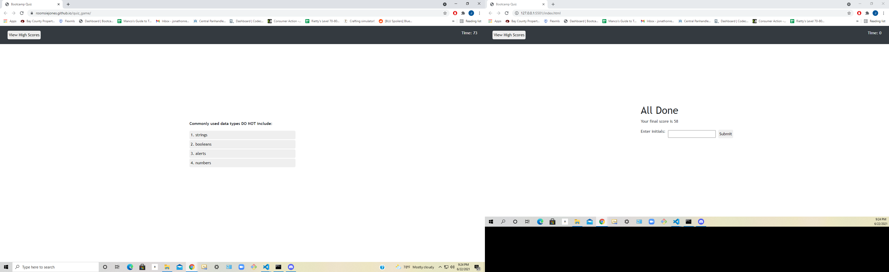

# quiz_game

(Work in progress)
## Description
###### *last updated 6/22/2021

The goal of this project was to create a timed quiz game that keeps track of scores locally to compare results with each other.
 
 

## Details about project

When the start button is clicked, one of five questions with answer buttons display on the screen. 

When a question is answered, user is told if the response was correct or wrong 
and a new question is displayed along with its associated answers.

When a question is answered incorrectly, ten seconds are subtracted from the clock.

When all the questions are answered or the user runs out of time, the game is over. 

When the game is over, initials can be entered with the score and are saved locally to compare to other attempts or other students. 

 
 
 

 

[Deployed website on Github](https://roomsiejones.github.io/quiz_game/)

[Github Repository Link](https://github.com/roomsiejones/quiz_game)